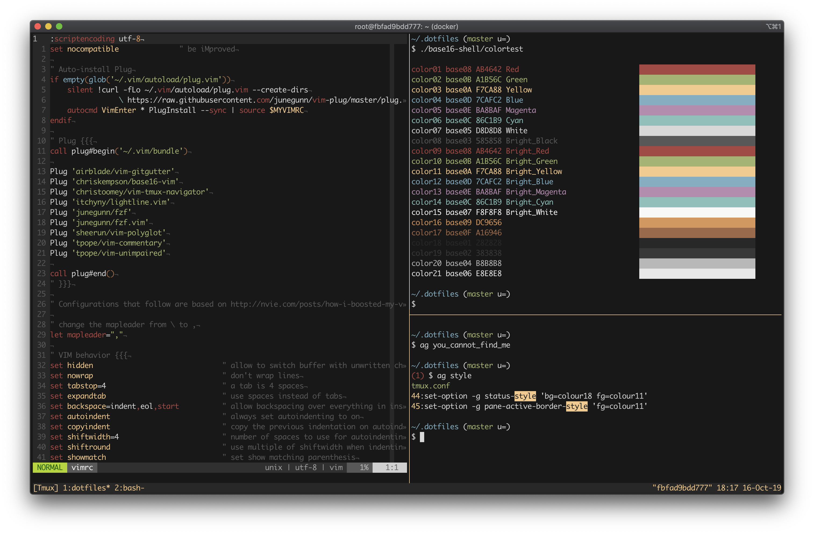

# Dotfiles for Terminal-only Environment



Set of dotfiles to set up:
* Bash
* Vim
* Tmux
* [Base16](https://github.com/chriskempson/base16-shell) color theme for shell and Vim
* [Fuzzy Finder](https://github.com/junegunn/fzf) (fzf)
* [The Silver Searcher](https://github.com/ggreer/the_silver_searcher) (ag)

To install it, run the following commands:

```sh
git clone https://github.com/slawekzachcial/terminal-dotfiles.git $HOME/.dotfiles
$HOME/.dotfiles/install.sh
. .bashrc
```

The installation script assumes it runs on Ubuntu.
